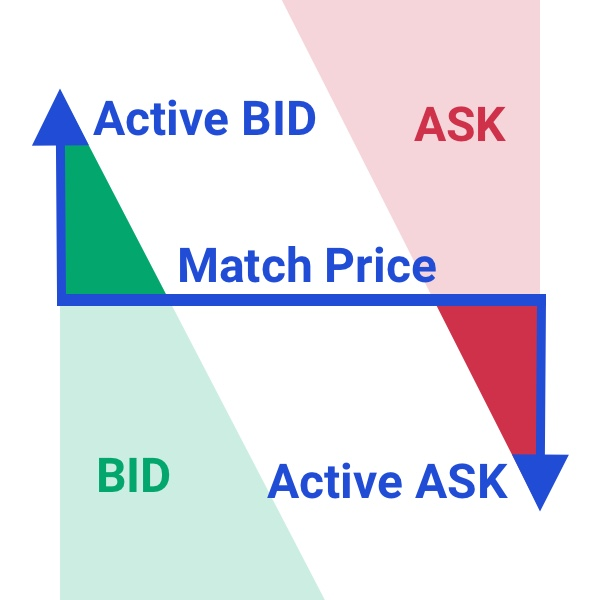

Introduction
************

| Documentation for Developers,
| by Developers

-----

.. _general_info:

General API Information
=======================

oscillo supports two networks [BNB Smart Chain(BSC), ETHEREUM].

BSC
   - REST_API_ENDPOINT: https://api-bsc.osc.finance
   - WEBSOCKET_API_ENDPOINT: wss://api-bsc.osc.finance

ETHEREUM
   - REST_API_ENDPOINT: https://api-eth.osc.finance
   - WEBSOCKET_API_ENDPOINT: wss://api-eth.osc.finance

All endpoints return either a JSON object or array.
All time and timestamp related fields are in milliseconds.

HTTP Return Codes
-----------------

- HTTP 4XX return codes are used for malformed requests; the issue is on the sender's side.
- HTTP 403 return code is used when the WAF Limit (Web Application Firewall) has been violated.
- HTTP 429 return code is used when breaking a request rate limit.
- HTTP 418 return code is used when an IP has been auto-banned for continuing to send requests after receiving 429 codes.
- HTTP 5XX return codes are used for internal errors; the issue is on oscillo internal server error.

Rate Limits
-----------

oscillo rate limiters defined about REST api calls.
When the api count exceeds the limit, you will receive a 429 error. Please check the following rate Limit rules.

===================== =========================== =======================
    RATE LIMIT             Duration(milliseconds)       Max Count
===================== =========================== =======================
    api Limiter            15 * 60 * 1000               1500
===================== =========================== =======================

WebSocket Heartbeat(ping/pong)
------------------------------

oscillo websocket's heartbeat interval is ``30_000 ms``, 
WS clients have to send the reponse(pong) to keep the connection alive or the connection will be broken.

.. _terminology:

Terminology
-----------

* **price**: The market price of oscillo. All orders are traded at the market price.

* **price_denom**: 1e6.

* **precision**: The range of the floating-point of the ``price``. ``lprice`` is expressed as a combination of ``precision`` and ``price_denom``. lprice = price.toFixed(precision) * price_denom

* **lprice**: the guaranteed price and is the worst price that can be accepted in the order request. For quick execution of orders, the ``lprice`` should be set at a disadvantage compared to the market ``price``. When the market ``price`` of BTC is $30,000, selling ``lprice`` should be less than $30,000, and buying ``lprice`` should be above $30,000. In the oscillo interface, ``lprice`` is displayed as only if [≥, ≤]

* **reserve**: This is the protocol reserve of the market deducted from your token received. The reserves are redistributed to participants through OSC tokens. TradingFee = reserve / reserve_denome * TradeVolume

* **reserve_denom**: 1e6.

* **minAmount**: Minimum tradable amount. If the available order amount is less than minAmount, the order will be cancelled automatically.

* **txFee**: The gas cost of executors performing transactions on your behalf. It is deducted from your token received. Denominated in dollar value.

* **buffer**: The weight of lprice relative to index price. In auto-limit mode, ``lprice`` is determined [*buy order* = index price + index price * (buffer / buffer_denom), *sell order* = index price - index price * (buffer / buffer_denom)]

* **buffer_denom**: 1e6.

.. _contract:

Contract
========

oscillo contract
  ============================== ================================================= 
      .. centered:: Contract      .. centered:: Address                   
  ============================== =================================================
      .. centered:: Exchange       0x63c33e25051cf97312983f5e9624E00E7b4A424A
      .. centered:: OSCToken       0x7e00AecaBA5df64e9FeFAb55aC6B3F58100e79E2  
  ============================== ================================================= 

.. _listing:

Listing
=======

.. note::

  :In Market:
    * **Base Token**: Refers to the asset that is the quantity. For the BTC-USDT Market, BTC would be the base token.
    * **Quote Token**: Refers to the asset that is the price. For the BTC-USDT Market, USDT would be the quote token.

BSC
    ========================= ======================= ======================================================
    .. centered:: Market ID    .. centered:: Type       .. centered:: Base / Quote Token Address                     
    ========================= ======================= ======================================================
    .. centered:: BTC-USDT     .. centered:: MAJOR      | 0x7130d2A12B9BCbFAe4f2634d864A1Ee1Ce3Ead9c(BTC)/
                                                         0x55d398326f99059fF775485246999027B3197955(USDT)
    .. centered:: ETH-USDT     .. centered:: MAJOR      | 0x2170Ed0880ac9A755fd29B2688956BD959F933F8(ETH)/
                                                         0x55d398326f99059fF775485246999027B3197955(USDT)
    .. centered:: BNB-USDT     .. centered:: MAJOR      | 0xbb4CdB9CBd36B01bD1cBaEBF2De08d9173bc095c(BNB)/
                                                         0x55d398326f99059fF775485246999027B3197955(USDT)  
    .. centered:: GMT-USDT     .. centered:: MAJOR      | 0x3019BF2a2eF8040C242C9a4c5c4BD4C81678b2A1(GMT)/
                                                         0x55d398326f99059fF775485246999027B3197955(USDT)
    .. centered:: CAKE-USDT    .. centered:: MAJOR      | 0x0E09FaBB73Bd3Ade0a17ECC321fD13a19e81cE82(CAKE)/
                                                         0x55d398326f99059fF775485246999027B3197955(USDT)                                  
    .. centered:: BUSD-USDT    .. centered:: MAJOR      | 0xe9e7CEA3DedcA5984780Bafc599bD69ADd087D56(BUSD)/
                                                         0x55d398326f99059fF775485246999027B3197955(USDT)
    .. centered:: USDC-USDT    .. centered:: MAJOR      | 0x8AC76a51cc950d9822D68b83fE1Ad97B32Cd580d(USDC)/
                                                         0x55d398326f99059fF775485246999027B3197955(USDT)
    .. centered:: GST-USDT     .. centered:: GROWTH     | 0x4a2c860cEC6471b9F5F5a336eB4F38bb21683c98(GST)/
                                                          0x55d398326f99059fF775485246999027B3197955(USDT)
    .. centered:: MBOX-USDT    .. centered:: GROWTH     | 0x3203c9E46cA618C8C1cE5dC67e7e9D75f5da2377(MBOX)/
                                                          0x55d398326f99059fF775485246999027B3197955(USDT)
    ========================= ======================= ======================================================

Ethereum
    ========================= ======================= ======================================================
    .. centered:: Market ID     .. centered:: Type     .. centered:: Base / Quote Token Address                      
    ========================= ======================= ======================================================
    .. centered:: BTC-USDC     .. centered:: MAJOR        | 0x2260FAC5E5542a773Aa44fBCfeDf7C193bc2C599(BTC)/
                                                           0xA0b86991c6218b36c1d19D4a2e9Eb0cE3606eB48(USDC)
    .. centered:: ETH-USDC     .. centered:: MAJOR        | 0xC02aaA39b223FE8D0A0e5C4F27eAD9083C756Cc2(ETH)/
                                                           0xA0b86991c6218b36c1d19D4a2e9Eb0cE3606eB48(USDC)
    .. centered:: DAI-USDC     .. centered:: MAJOR       | 0x6B175474E89094C44Da98b954EedeAC495271d0F(DAI)/
                                                           0xA0b86991c6218b36c1d19D4a2e9Eb0cE3606eB48(USDC)
    .. centered:: USDT-USDC    .. centered:: MAJOR       | 0xdAC17F958D2ee523a2206206994597C13D831ec7(USDT)/
                                                           0xA0b86991c6218b36c1d19D4a2e9Eb0cE3606eB48(USDC)
    ========================= ======================= ======================================================

