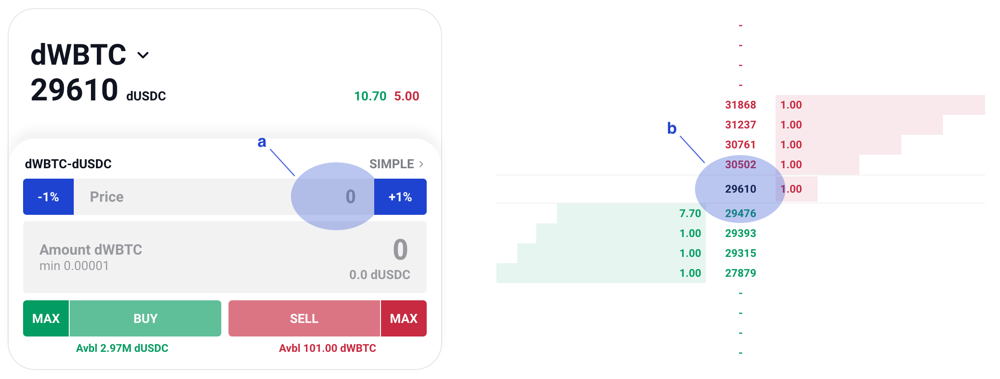

Trade with an expert mode
=========================

.. role:: raw-html(raw)
    :format: html;

Interface
---------

Here’s the expert mode.

:raw-html:` `

a. You can click the plus or minus button to adjust the limit price or enter it manually.

b. Market depth

Step
----

#. Enter the limit price and amount of selected token that you want to trade.

#. Click 'BUY' or 'SELL' button.

#.  Check your trigger condition and fees.

    * Keep the ordered amount  in your wallet or your order will be canceled.

    * Settlement fee is paid by the executors performing transactions on your behalf. This fee will be automatically deducted from the tokens you receive from buying or selling.

.. figure:: static/sell2.png
    :align: center
    :figwidth: 100%

:raw-html:` `

4. You will receive a signature request from 'osc.finance' in the wallet app. After confirming it, you will be able to see your order on the open order list.
