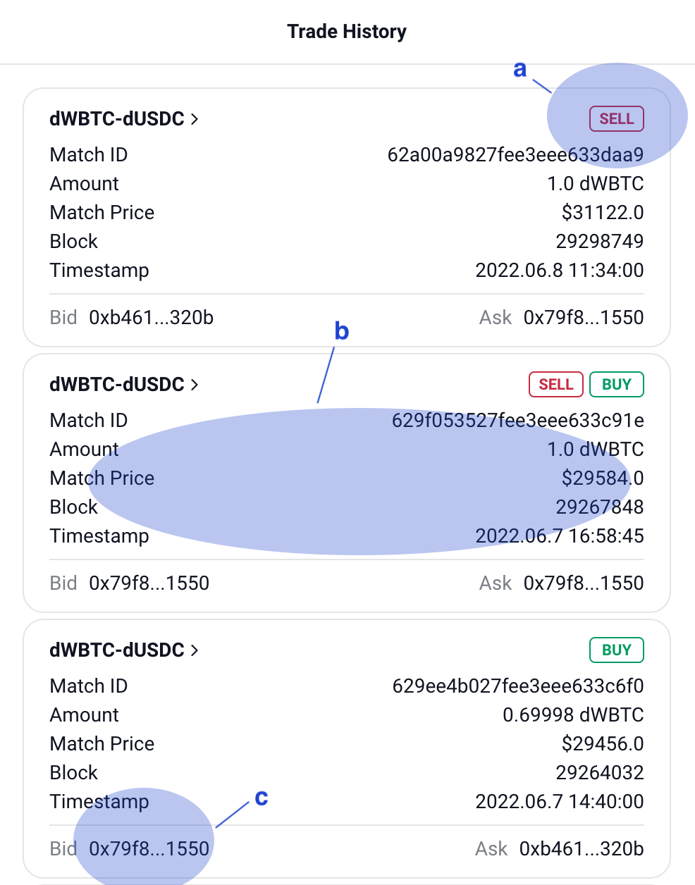
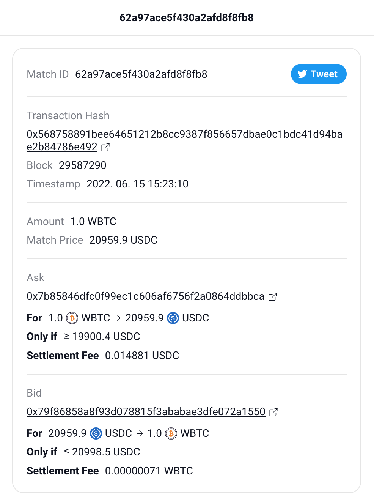

Check trade history
===================

Interface
---------

Here's the trade history. One order can show as several trades if your trading amount is too big. This means that several trades were needed to fulfill your order.

a. Your position in this trade
b. Match details: Amount, Match price, Block, Timestamp
c. Addresses of the buyer and seller

Here's the match detail. You can see this page when you click on a trade

a. Match details: + Transaction hash
b. Ask(Sell) details: Condition, Fee
c. Bid(Buy) details: Condition, Fee

