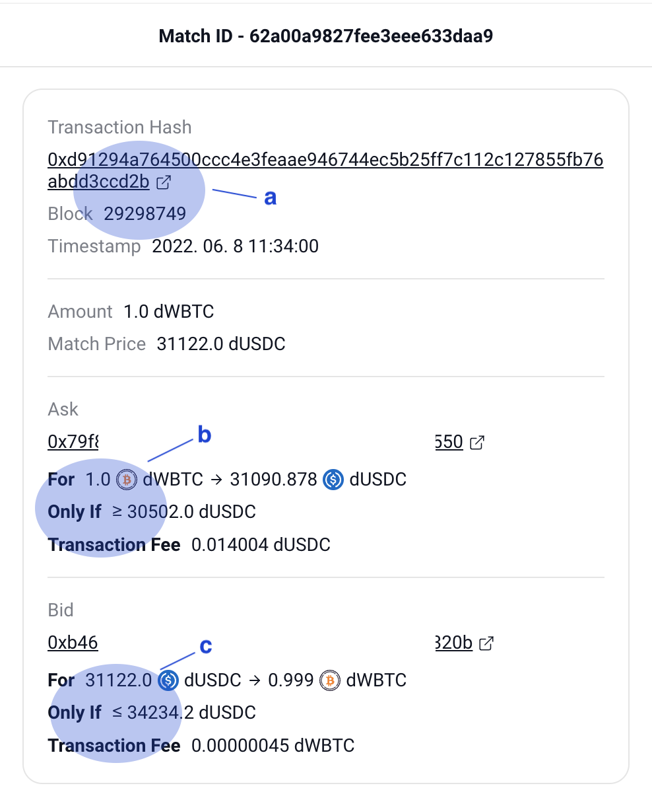

Check trade history
===================

Interface
---------

Here's the trade history. There are some trades on this list. Even one order can have several trades if your trading volume is huge. It means that several trades are needed to fulfill your order.

.. figure:: static/trade_history_part.png
    :align: center
    :figwidth: 100%

a. Your position in this trade
b. Match details: Amount, Match price, Block, Timestamp
c. User address of each side

Here's the match detail. You can see this page when you click on one of the trades.

a. Match details: + Transaction hash
b. Ask(Sell) side details: Condition, Fee
c. Bid(Buy) side details: Condition, Fee

