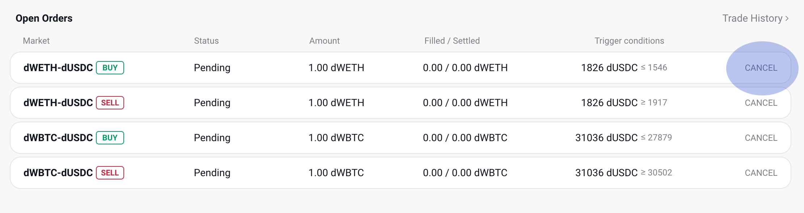

Open orders
===========

Check open orders
*****************

Interface
---------
Here are open orders

.. figure:: static/open_order_part.png
    :align: center
    :figwidth: 100%

a. Your position

b. There are three statuses for an order; Active, Filled, and Canceled.
    - Active: searching for orders that go along with your trigger condition
    - Filled: order fulfilled
    - Canceled: the order is canceled
c. 'Filled' shows the amount that order is fulfilled.  'Amount' minus 'Filled' is the remaining order.
d. You can see your trade history with this button.

Cancel open orders
******************

Step
----

1. Click the 'CANCEL' button on the open order list.

2. Click the 'Confirm' button on the cancel modal if you've checked your already filled amount and the warning. (Cancellation is possible only for the quantity excluding the scheduled amount.)

