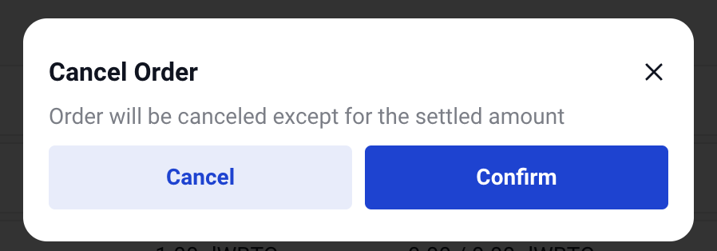

Open orders
===========

Check open orders
*****************

Interface
---------
Here are open orders

.. figure:: static/open_order_part.png
    :align: center
    :figwidth: 100%

a. Your position in the market

b. There are three statuses for an order; Pending, Filled, and Canceled.
    - Active: searching the orders with your condition
    - Filled: complete the trading
    - Canceled: the order is canceled.
c. 'Filled' shows the amount that trading is completed.  'Amount' minus 'Filled' is the remaining order.
d. You can see your trade history with this button.

Cancel open orders
******************

Step
----

1. Click the 'CANCEL' button on the open order list.

.. figure:: static/click_cancel.png
    :align: center
    :figwidth: 100%

2. Click the 'Confirm' button if you've checked your settled amount and the warning.

