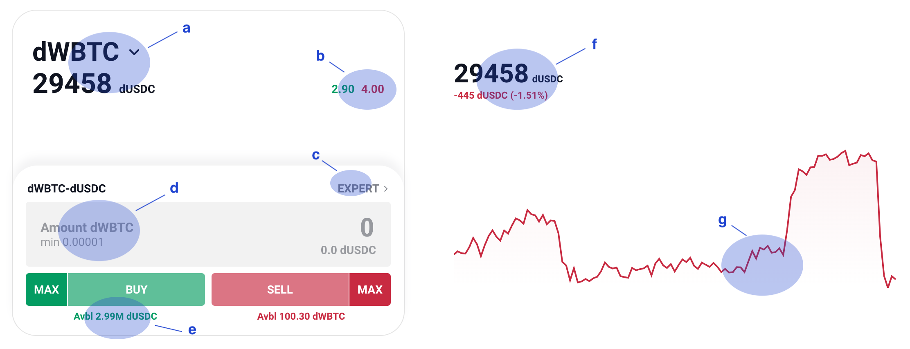
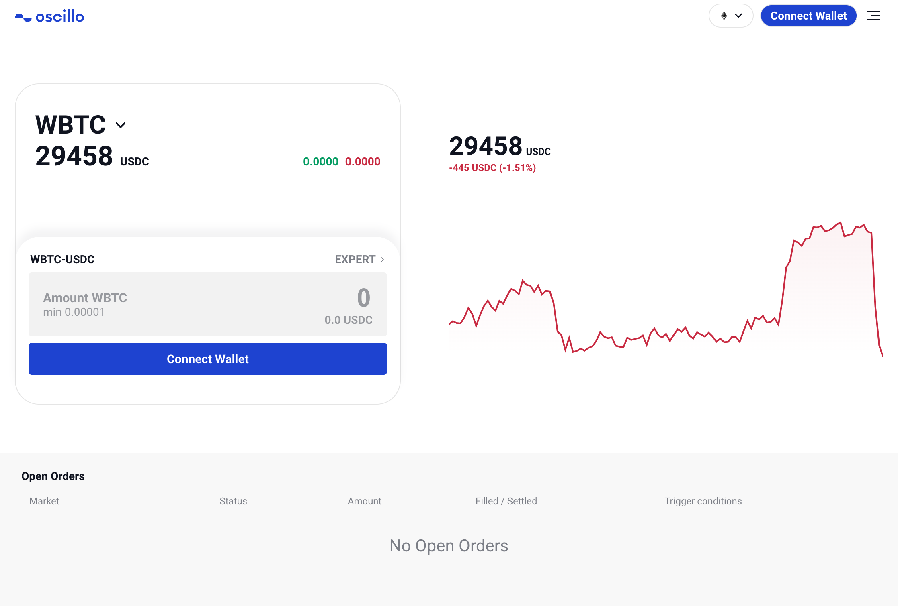
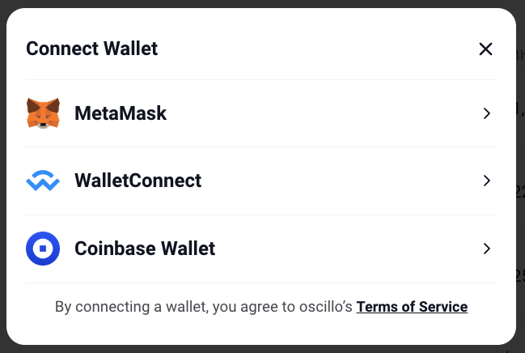
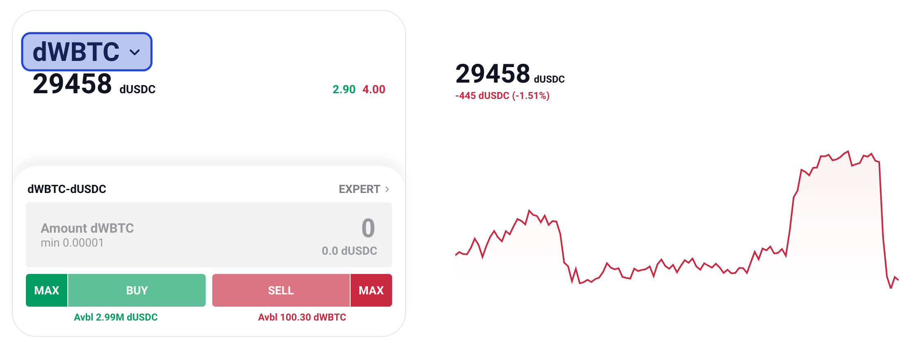
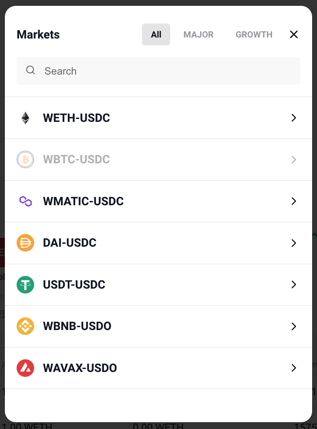
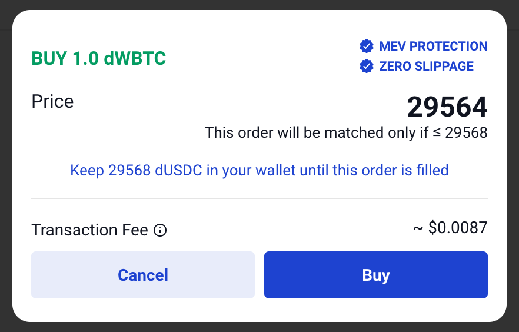
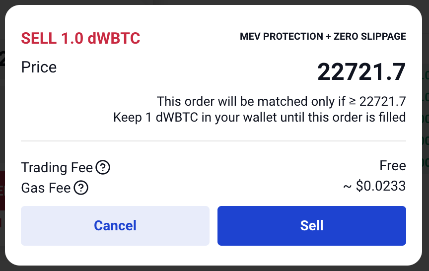

Trade with a simple mode
========================

.. role:: raw-html(raw)
    :format: html;

Interface
---------

Here's the trading interface

a. Token selection
b. These two numbers mean buy(bid, green) side token and sell(ask, red) side token.
c. Simple mode to expert mode or vice versa
d. Where you input the desired amount of selected token to trade. Minimum amount may change depending on gas fee.
e. Your wallet balance
f. Latest price of selected token
g. Hourly price change of selected token

Step
----

1. Click 'Connect Wallet' and choose preferred wallet.

:raw-html:` `

- We currently support Metamask, Trust Wallet, Math Wallet, and WalletConnect.

:raw-html:` `

2. Click '▼' to select token.

:raw-html:` `

- dWBTC, dWETH, and dUSDC are testing tokens with no real value.

:raw-html:` `

3.  Enter your desired amount of selected token and click the 'BUY' or 'SELL' button.

4.  Check your trigger condition and transaction fee.

    * Keep the ordered amount in your wallet or order will be canceled.

    * The transaction fee is the gas fee. This fee will be automatically subtracted from the tokens you receive from buying or selling.

:raw-html:` `

5. You will receive a signature request from 'osc.finance' in the wallet app. After confirming it, you will be able to see your order on the open order list.

