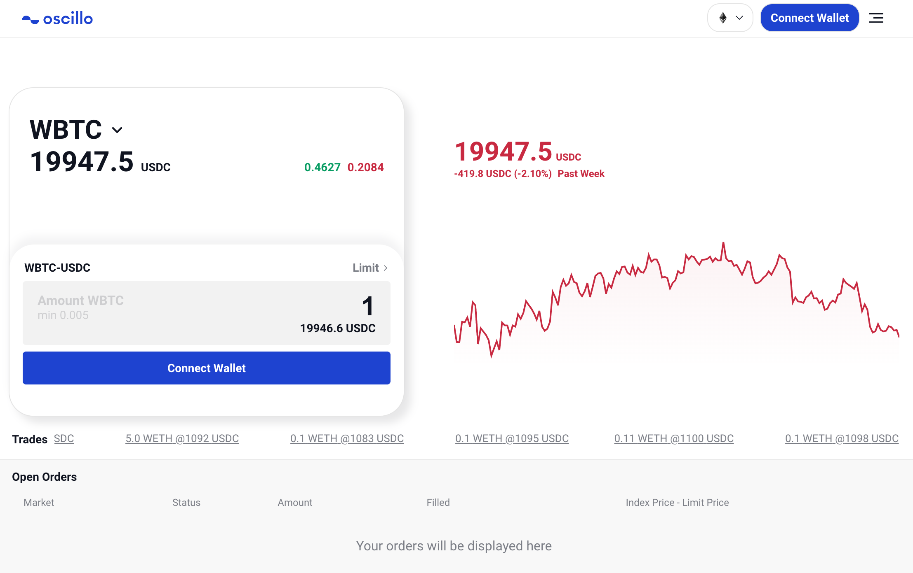
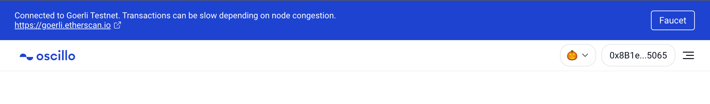
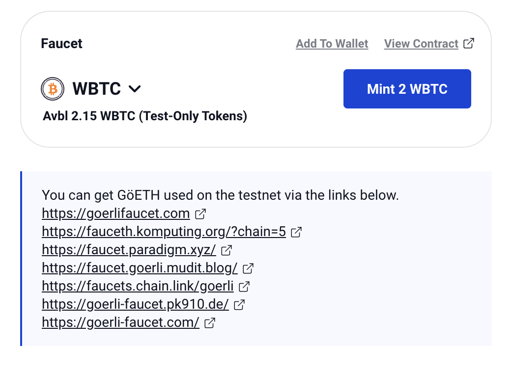

Try the testnet app
========================

.. role:: raw-html(raw)
    :format: html;

Step
-----

1. Click the network icon and choose ‘Goerli Testnet’.

:raw-html:` `

- We currently support ‘Goerli Testnet’.

.. figure:: static/choose_network.png
    :align: center
    :figwidth: 100%

:raw-html:` `

2. Click 'Faucet' to get test tokens.

:raw-html:` `

3. If you have some GöETH, choose the token that you want to mint and click the mint button.

- If you don't have any GöETH(native token for Goerli Testnet), click the links below and get some.

:raw-html:` `

4.  Now, you can trade with test tokens. If you don't know how to trade, please see the quickstart guide.

